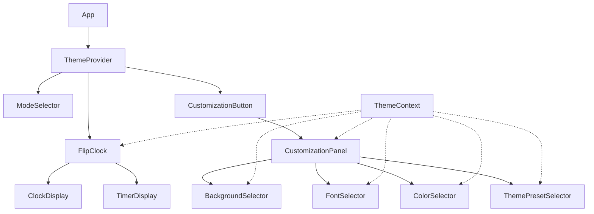
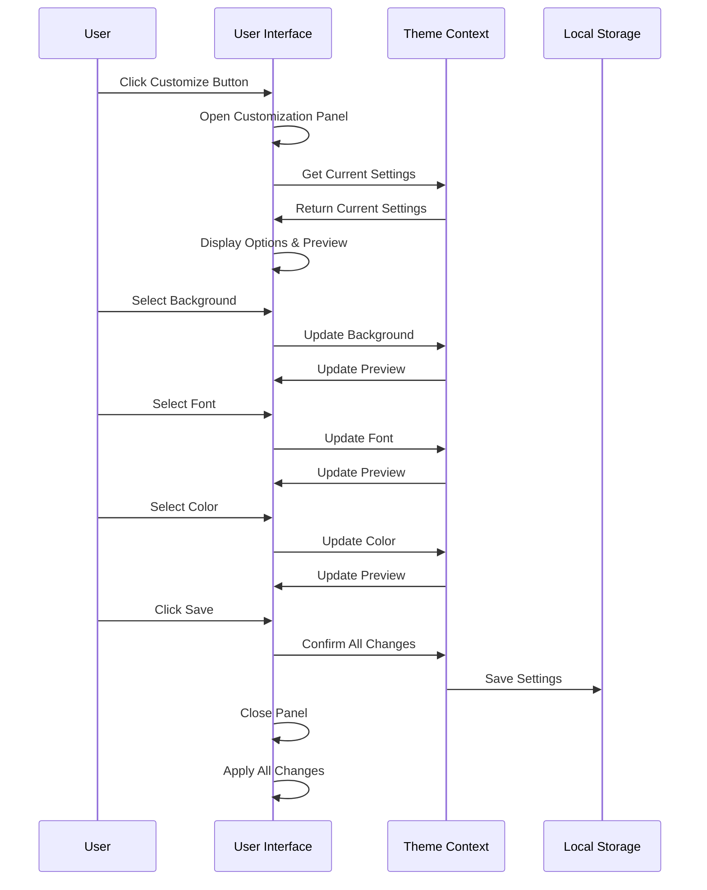

# Design Document: Clock Customization

## Overview

The Clock Customization feature will enhance the existing flip clock application by providing users with options to personalize the visual appearance of the clock. This includes background selection, font choices, and color customization for both the clock and its panels. The design focuses on creating an intuitive and seamless customization experience while maintaining the aesthetic integrity and functionality of the application.

## Architecture

The customization feature will be implemented using React components and contexts to manage the state of customization settings across the application. The architecture will follow these principles:

1. **Component-Based Design**: Each customization feature (backgrounds, fonts, colors) will be implemented as separate components that can be composed together in the customization UI.

2. **Context-Based State Management**: A new ThemeContext will be created to manage and provide customization settings throughout the application.

3. **Local Storage Integration**: User preferences will be persisted using the browser's localStorage API.

4. **Separation of Concerns**: The customization logic will be separated from the core clock functionality to maintain code clarity and ease of maintenance.

## Components and Interfaces

### 1. ThemeContext

A new context will be created to manage theme-related state across the application:

```jsx
// ThemeContext.jsx
import { createContext, useState, useEffect } from "react";

export const ThemeContext = createContext();

export const ThemeProvider = ({ children }) => {
  // State for all customization options
  const [background, setBackground] = useState("default");
  const [font, setFont] = useState("default");
  const [clockColor, setClockColor] = useState("#000000");
  const [panelColor, setPanelColor] = useState("#FFFFFF");

  // Load saved settings on mount
  // Save settings when they change

  return (
    <ThemeContext.Provider
      value={{
        background,
        setBackground,
        font,
        setFont,
        clockColor,
        setClockColor,
        panelColor,
        setPanelColor,
      }}
    >
      {children}
    </ThemeContext.Provider>
  );
};
```

### 2. CustomizationButton Component

A button component that will be placed next to the mode selector to open the customization panel, using a paintbrush icon from react-icons:

```jsx
// CustomizationButton.jsx
import { FaPaintBrush } from "react-icons/fa";

const CustomizationButton = ({ onClick }) => {
  return (
    <button
      className="icon-button customization-button"
      onClick={onClick}
      aria-label="Customize appearance"
    >
      <FaPaintBrush />
    </button>
  );
};
```

### 3. CustomizationPanel Component

A modal component that contains all customization options and provides a live preview:

```jsx
// CustomizationPanel.jsx
const CustomizationPanel = ({ isOpen, onClose }) => {
  // Implementation details

  return (
    <div className={`customization-panel ${isOpen ? "open" : ""}`}>
      <div className="preview-section">
        {/* Clock preview with current settings */}
      </div>
      <div className="options-section">
        <BackgroundSelector />
        <FontSelector />
        <ColorSelector type="clock" />
        <ColorSelector type="panel" />
      </div>
      <div className="actions">
        <button onClick={handleSave}>Save</button>
        <button onClick={onClose}>Cancel</button>
      </div>
    </div>
  );
};
```

### 4. BackgroundSelector Component

Component for selecting preset backgrounds:

```jsx
// BackgroundSelector.jsx
const BackgroundSelector = () => {
  const { background, setBackground } = useContext(ThemeContext);

  // Implementation details

  return (
    <div className="background-selector">
      <h3>Background</h3>
      <div className="background-options">{/* Background options */}</div>
    </div>
  );
};
```

### 5. FontSelector Component

Component for selecting font options:

```jsx
// FontSelector.jsx
const FontSelector = () => {
  const { font, setFont } = useContext(ThemeContext);

  // Implementation details

  return (
    <div className="font-selector">
      <h3>Font</h3>
      <div className="font-options">{/* Font options */}</div>
    </div>
  );
};
```

### 6. ColorSelector Component

Component for selecting colors with both preset options and a color picker:

```jsx
// ColorSelector.jsx
const ColorSelector = ({ type }) => {
  const { clockColor, setClockColor, panelColor, setPanelColor } =
    useContext(ThemeContext);

  const color = type === "clock" ? clockColor : panelColor;
  const setColor = type === "clock" ? setClockColor : setPanelColor;

  // Implementation details

  return (
    <div className="color-selector">
      <h3>{type === "clock" ? "Clock Color" : "Panel Color"}</h3>
      <div className="preset-colors">{/* Preset color options */}</div>
      <div className="custom-color">
        <label>Custom Color</label>
        <input
          type="color"
          value={color}
          onChange={(e) => setColor(e.target.value)}
        />
      </div>
    </div>
  );
};
```

### 7. ThemePresetSelector Component

Component for selecting predefined theme presets that set multiple customization options at once:

```jsx
// ThemePresetSelector.jsx
const ThemePresetSelector = () => {
  const { setBackground, setFont, setClockColor, setPanelColor } =
    useContext(ThemeContext);

  // Implementation details

  return (
    <div className="theme-preset-selector">
      <h3>Theme Presets</h3>
      <div className="theme-options">{/* Theme preset options */}</div>
    </div>
  );
};
```

## Data Models

### 1. Theme Settings

```typescript
interface ThemeSettings {
  background: string;
  font: string;
  clockColor: string;
  panelColor: string;
}
```

### 2. Background Option

```typescript
interface BackgroundOption {
  id: string;
  name: string;
  value: string; // CSS value or image URL
  thumbnail: string; // URL for preview thumbnail
}
```

### 3. Font Option

```typescript
interface FontOption {
  id: string;
  name: string;
  value: string; // CSS font-family value
  sample: string; // Sample text for preview
}
```

### 4. Color Preset

```typescript
interface ColorPreset {
  id: string;
  name: string;
  value: string; // Hex color code
  thumbnail: string; // URL for color swatch
}
```

### 5. Theme Preset

```typescript
interface ThemePreset {
  id: string;
  name: string;
  settings: ThemeSettings;
  thumbnail: string; // URL for theme preview
}
```

## Error Handling

1. **Invalid Color Values**: The application will validate color inputs and fall back to default values if invalid colors are provided.

2. **Font Loading Failures**: If a selected font fails to load, the application will fall back to a system font to ensure text remains readable.

3. **Background Loading Issues**: If a background image fails to load, the application will display a fallback solid color background.

4. **Storage Errors**: If saving to localStorage fails, the application will notify the user and continue functioning with the current settings for the session.

## Testing Strategy

### 1. Unit Tests

- Test each customization component in isolation
- Verify that the ThemeContext correctly manages and updates state
- Test the persistence layer for saving and loading settings

### 2. Integration Tests

- Test the interaction between customization components and the main clock components
- Verify that theme changes are correctly applied throughout the application
- Test the preview functionality to ensure it accurately reflects customization changes

### 3. User Interface Tests

- Test the customization UI for usability and accessibility
- Verify that the color picker works correctly
- Test that font changes are applied correctly
- Verify that background changes are applied correctly

### 4. Storage Tests

- Test saving and loading settings from localStorage
- Test handling of missing or corrupt settings data
- Verify that settings persist across page reloads

## Implementation Considerations

### 1. Performance

- Optimize background images for web use to minimize loading times
- Preload fonts to reduce layout shifts when changing fonts
- Use CSS variables for theme properties to minimize DOM updates when changing themes

### 2. Accessibility

- Ensure sufficient contrast between text and backgrounds
- Provide text labels for all customization options
- Make the customization panel fully keyboard navigable

### 3. Responsive Design

- Ensure the customization UI works well on both desktop and mobile devices
- Adapt the preview size based on screen size
- Consider a simplified UI for very small screens

## Diagrams

### Component Relationship Diagram



### User Flow Diagram


