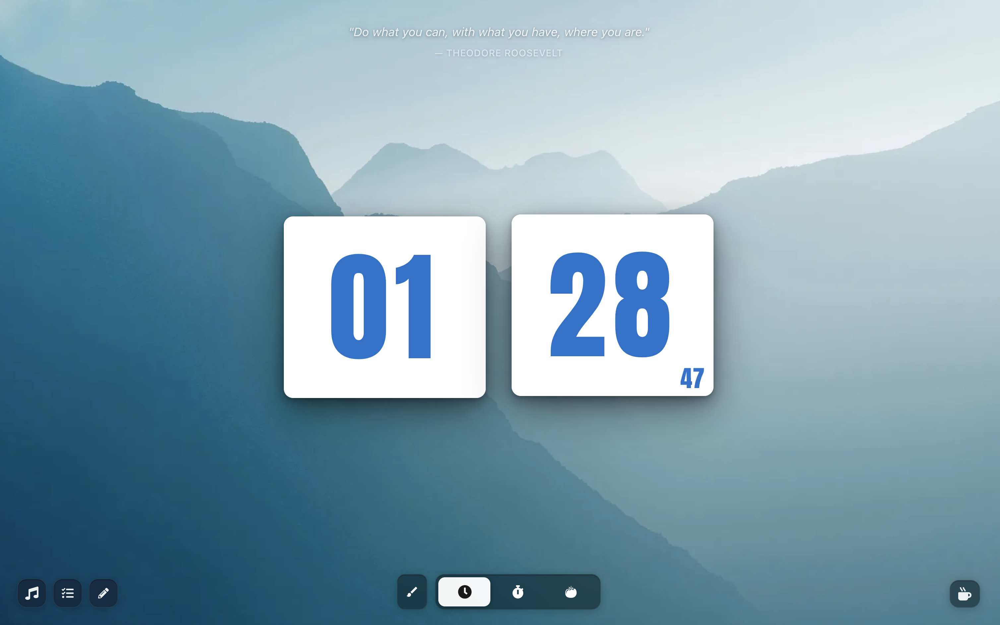
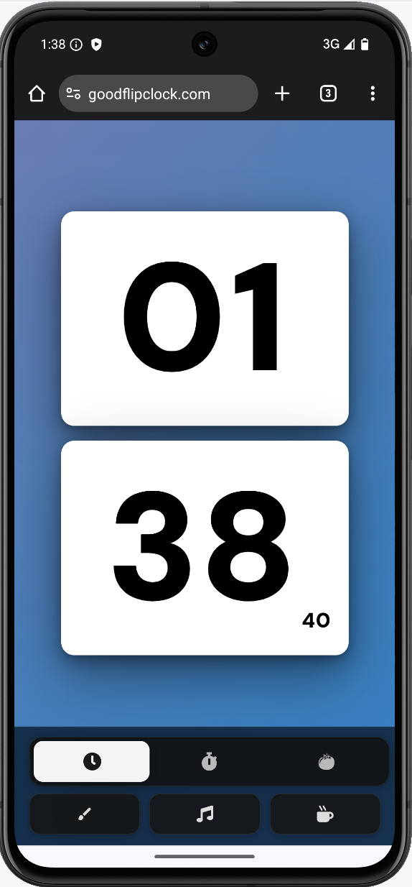

# Flip Clock

A full-screen, immersive flip clock app for focus sessions — built with React + Vite.

## Preview

<div align="center">
  
  &nbsp;&nbsp;
  
</div>

## Features

### Modes

- **Clock** — Real-time clock with animated flip cards and a mini seconds badge
- **Timer** — Countdown timer with configurable hours/minutes/seconds
- **Pomodoro** — Structured work/break sessions with automatic session transitions (focus → short break → long break cycle)

### Customization

- **Backgrounds** — 16 curated local WebP images, CSS gradients, and solid colors
- **Fonts** — Multiple typeface options (Impact, Roboto, Orbitron, and more)
- **Colors** — Custom digit color and card panel color via spectrum color pickers
- All settings persist across sessions via `localStorage`

### Desktop UX

- **Focus mode** — After 20 s of inactivity all chrome fades out, leaving only the clock; any mouse movement restores it
- **Mode selector pill** — Fixed glassmorphic bar at the bottom center for switching modes
- **Inspirational quote** — Fades in at the top of the screen on load
- **Floating panels** — Music player (YouTube IFrame API, 4 study stations), Task list, Notes, and a Buy Me a Coffee button

### Mobile UX

- **Portrait** — Two vertically-stacked flip cards sized to fill as much screen height as possible; inspirational quote hidden; tap-to-focus collapses all chrome after 4 s of inactivity
- **Landscape** — Horizontal card layout; controls and quote hidden; customization button fixed at bottom-right
- **Mobile bottom bar** — Persistent bottom navigation with mode indicator dots, timer/pomodoro controls, and utility buttons (customize, music, coffee)
- **Swipe to change mode** — Left/right swipe on the clock area cycles through Clock → Timer → Pomodoro
- **Mode label** — 3 s fade toast at the top of the screen on every mode change

### Animation System

- `rotateX(-180deg)` flip animation (0.6 s ease-in-out) with `transform-origin: center calc(100% + 2px)` pivot at the card center gap
- `scaleX` mode-transition animation (not `rotateY`) — keeps `backdrop-filter` working on all glassmorphic fixed elements
- All animations are GPU-compositor-safe: no 3D rendering contexts on ancestors of `position: fixed` elements

## Tech Stack

- **React 18** + **Vite**
- Plain CSS (no Tailwind, no CSS-in-JS)
- `react-icons` for the icon set
- YouTube IFrame API for the music player

## Getting Started

```bash
npm install
npm run dev
```

Build for production:

```bash
npm run build
npm run preview
```

## Project Structure

```
src/
├── App.jsx / App.css            # Root layout, responsive breakpoints, focus/tap-to-focus
├── main.jsx                     # Entry point; imports index.css
├── constants/                   # MODES, TIMER_STATES, POMODORO_SESSION_TYPES, …
├── contexts/
│   └── ThemeContext.jsx          # Global theme (background, font, clockColor, panelColor)
├── hooks/
│   ├── useTimer.js               # Countdown timer logic + flip animation state
│   └── usePomodoroTimer.js       # Pomodoro session management
├── utils/
│   ├── colorUtils.js             # isLightColor() — drives dark/light text mode
│   └── fontUtils.js              # FONT_OPTIONS registry
├── styles/
│   └── cross-browser-fixes.css  # Vendor prefixes and browser-specific patches
└── components/
    ├── BackgroundLayer/          # position:fixed z:0 layer; GPU-crossfades backgrounds
    ├── FlipClock/                # Central display + FlipCard animation engine
    │   └── displays/             # ClockDisplay, TimerDisplay, PomodoroDisplay, FlipCardGrid
    ├── ModeSelector/             # Glassmorphic bottom pill (desktop only)
    ├── MobileBottomBar/          # Bottom navigation bar (mobile only)
    ├── TimerControls/            # Desktop play/pause/stop for timer mode
    ├── PomodoroControls/         # Desktop controls + skip for pomodoro mode
    ├── CustomizationPanel/       # Tabbed modal: Background / Fonts / Colors
    ├── BackgroundSelector/       # Image/gradient/color picker grid
    ├── MusicPlayer/              # YouTube IFrame streaming panel
    ├── TaskList/                 # Persistent to-do panel
    ├── Notes/                    # Scratchpad panel
    ├── InspirationalQuote/       # Fixed top quote (desktop + tablet only)
    ├── PomodoroSessionIndicator/ # Session progress dots (desktop + tablet only)
    └── TimerSettings / PomodoroSettings / …

public/
└── images/backgrounds/           # 16 WebP background images (compressed)
    └── thumbs/                   # Thumbnail versions for the picker grid
```

## Docs

- [Architecture](docs/ARCHITECTURE.md)
- [Components API](docs/COMPONENTS.md)
- [Customization Guide](docs/CUSTOMIZATION_GUIDE.md)
- [Mobile UX](docs/MOBILE_UTILITIES.md)
- [Deployment](docs/DEPLOYMENT.md)
- [Cross-Browser Testing](docs/CROSS_BROWSER_TESTING.md)
